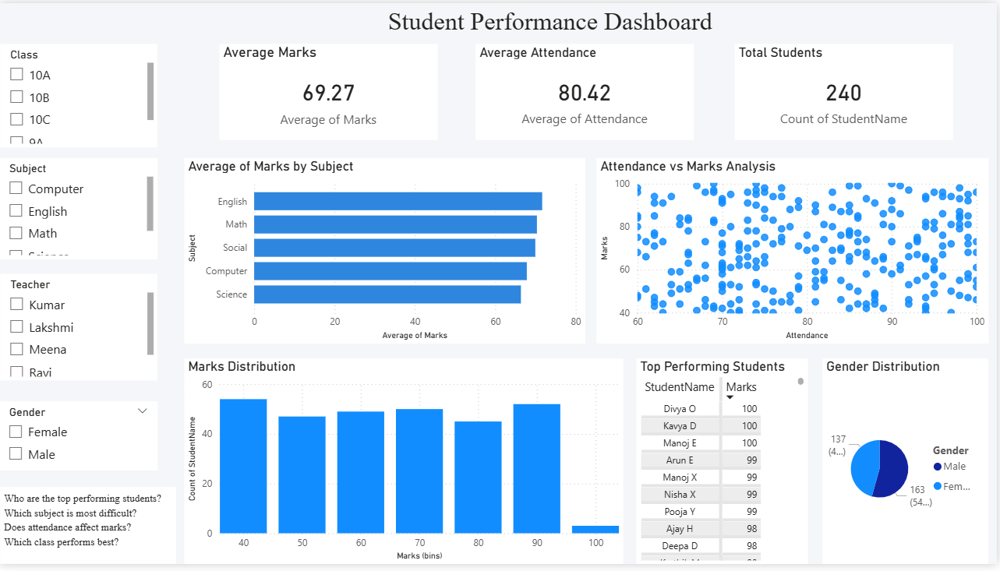

#  Student Performance Analytics Dashboard

## Dashboard Preview

##  Project Overview
This project analyzes student performance using Power BI. It provides insights into academic performance, attendance impact, and subject difficulty.

## 📌 Features
- KPI Cards (Average Marks, Attendance, Total Students)
- Subject-wise performance analysis
- Attendance vs Marks (Scatter Plot)
- Marks Distribution (Histogram)
- Student Ranking Table
- Interactive Slicers

##  Key Insights
- Higher attendance leads to better academic performance
- Some subjects have lower average marks indicating difficulty

##  Tools Used
- Power BI
- Excel

## File
- student-performance-dashboard.pbix
